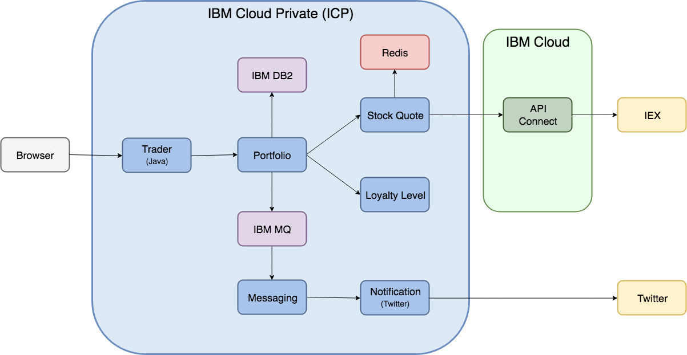
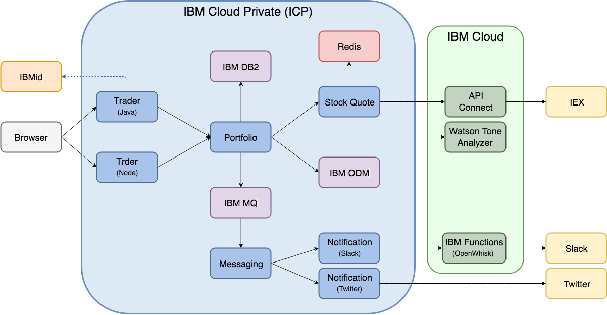

# stocktrader-app

This GitHub repository contains the IBM StockTrader Application Helm chart. There are two versions of the application each of them with their own branch within this repository.

## Version 1 (TBD)

This first version of the IBM StockTrader Application is a more reduced version functionality wise. The IBM StockTrader Application does not use the IBM Operational Decision Manager (ODM) for determining the loyalty level, does not interact with IBM Watson and does not send notifications to Slack.

Go to [**v1 branch**](https://github.com/ibm-cloud-architecture/stocktrader-app/tree/v1) for more info on the IBM StockTrader Application Version 1.

**IMPORTANT:** This version is yet to be completed.

## Version 2

This second version of the IBM StockTrader Application integrates with the IBM Operational Decision Manager (ODM) as well as with other IBM Cloud Public and third parties services.

Go to [**v2 branch**](https://github.com/ibm-cloud-architecture/stocktrader-app/tree/v2) for more info on the IBM StockTrader Application Version 2.
