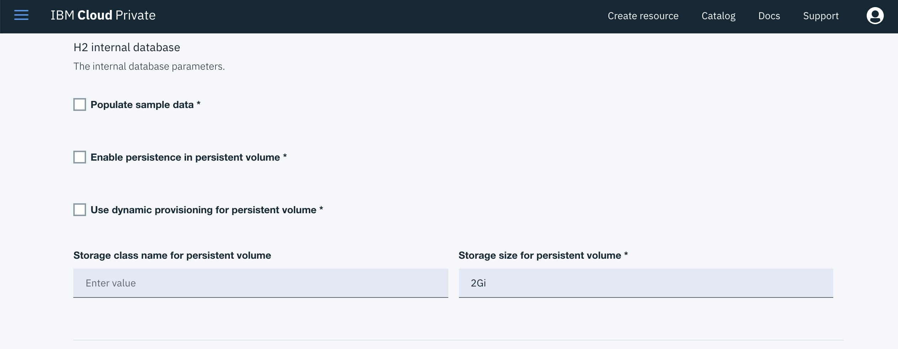

# IBM StockTrader Application Version 2 (ICP + RHOS)

1.  [Introduction](#introduction)
2.  [Installation](#installation)
    - [Get The Code](#get-the-code)
    - [Platform](#platform)
    - [Middleware](#middleware)
      - [IBM DB2](#ibm-db2)
      - [IBM MQ](#ibm-mq)
      - [IBM ODM](#ibm-odm)
      - [Redis](#redis)
    - [Application](#application)
      - [Configure](#configure)
      - [Install](#install)
3.  [Verification](#verification)
4.  [Uninstallation](#uninstallation)
5.  [Files](#files)
6.  [Links](#links)

## Introduction

This branch contains the instructions to install the IBM StockTrader Application Version 2 on IBM Cloud Private (ICP) which, in turn, goes on top of the RedHat OpenShift Container Platform (OCP).

The overall architecture looks like the following diagram:

<p align="center">

</p>

Where you can find the StockTrader application's specific microservices in blue and the IBM middleware it integrates with in purple all of them running on IBM Cloud Private (ICP), IBM Cloud Public services in green and other third party applications in other different colours.

## Installation

As shown in the IBM StockTrader Application architecture diagram above, the IBM StockTrader Application environment within IBM Cloud Private (ICP) is made up of IBM middleware such as **IBM DB2**, **IBM MQ** and **IBM ODM**, third party applications like **Redis** and the IBM StockTrader Application microservices **Trader**, **Tradr**, **Portfolio**, **Stock-quote**, **Messaging**, **Notification-Twitter** and **Notification-Slack** (last two being, unfortunately, mutually exclusive for now).

In this section, we will outline the steps needed in order to get the aforementioned components installed into IBM Cloud Private (ICP). We will try to use as much automation as possible as well as Helm charts for installing as many components as possible. Most of these components require post-installation configuration.

**IMPORTANT:** The below installation steps will create Kubernetes resources with names and configurations that the IBM StockTrader Helm chart expects. Therefore, if any of these is changed, the IBM StockTrader Helm chart installation configuration/details will need to be modified accordingly.

Finally, most of the installation process will be carried out by using the IBM Cloud Private CLI (`cloudctl`). Follow this [link](https://www.ibm.com/support/knowledgecenter/en/SSBS6K_3.1.0/manage_cluster/install_cli.html) for the installation instructions.

Also, bear in mind that the `cloudctl` CLI might get the Kubernetes Server API port incorrectly set in `~/.kube/config`. Check this [link](https://github.ibm.com/IBMPrivateCloud/roadmap/issues/18396) out for further information.

### Get The Code

Before anything else, we need to **clone this Github repository** onto our workstations in order to be able to use the scripts, files and tools mentioned throughout this readme. To do so, clone this GitHub repository to a convenient location for you:

```
$ git clone https://github.com/ibm-cloud-architecture/stocktrader-app.git
Cloning into 'stocktrader-app'...
remote: Counting objects: 163, done.
remote: Compressing objects: 100% (120/120), done.
remote: Total 163 (delta 73), reused 116 (delta 38), pack-reused 0
Receiving objects: 100% (163/163), 8.94 MiB | 1.06 MiB/s, done.
Resolving deltas: 100% (73/73), done.
```

Afterwards, change directory to `stocktrader-app` and checkout the stocktrader-app github repository **v2_rhos** branch:

```
$ git checkout v2_rhos
Switched to branch 'v2_rhos'
Your branch is up to date with 'origin/v2_rhos'.
```

### Platform

[github issue](https://github.ibm.com/IBMPrivateCloud/roadmap/issues/19086)
1. Allow your RedHat OpenShift Container Platform cluster to pull images from [docker.io](https://docker.io):
   1. ssh into each master and worker nodes and execute the following to add docker.io as a trusted docker registry:
   ```
   $ sed -i "s/ADD_REGISTRY.*$/ADD_REGISTRY=\'--add-registry docker.io --add-registry registry.access.redhat.com\'/g" /etc/sysconfig/docker
   ```
   2. restart docker:
   ```
   $ systemctl restart docker
   ```

[github issue](https://github.ibm.com/IBMPrivateCloud/roadmap/issues/19165)
2. [Taint your master nodes](https://kubernetes.io/docs/concepts/configuration/taint-and-toleration/#concepts) so that the workloads you deploy get scheduled to the worker nodes only:

```
kubectl taint nodes <MASTER_NODE> dedicated=infra:NoSchedule
```

3. [Create a namespace](https://www.ibm.com/support/knowledgecenter/en/SSBS6K_3.1.0/user_management/create_project.html) called **stocktrader**:

```
$ kubectl create namespace stocktrader
namespace "stocktrader" created
```

4. [Target your IBM Cloud Private CLI](https://www.ibm.com/support/knowledgecenter/en/SSBS6K_3.1.0/manage_cluster/cli_commands.html#target) to work against your **stocktrader** namespace:

```
$ cloudctl target -n stocktrader

Namespace:   stocktrader
```

5. Create a [Service Account](https://kubernetes.io/docs/reference/access-authn-authz/service-accounts-admin/) your middleware will get deployed on behalf of:

```
$ kubectl create serviceaccount stocktrader-sa -n stocktrader
serviceaccount "stocktrader-sa" created
```

### Middleware

As previously said, IBM middleware will be installed using Helm charts as much as possible. Therefore, we need to add the IBM Helm chart repository to our local Helm chart repositories:

```
$ helm repo add ibm-charts https://raw.githubusercontent.com/IBM/charts/master/repo/stable/
"ibm-charts" has been added to your repositories

$ helm repo list
NAME                    	URL                                                                                                      
stable                  	https://kubernetes-charts.storage.googleapis.com                                                         
local                   	http://127.0.0.1:8879/charts                                                                             
ibm-charts              	https://raw.githubusercontent.com/IBM/charts/master/repo/stable/
```

(\*) If you don't have a **stable** Helm repo pointing to https://kubernetes-charts.storage.googleapis.com, please add it too using:

```
$ helm repo add stable https://kubernetes-charts.storage.googleapis.com
```

#### IBM DB2

User must be subscribed to [Db2 Developer-C Edition on Docker Store](https://store.docker.com/images/db2-developer-c-edition) so they can generate a key to access the image. After subscription, visit [Docker Cloud](https://cloud.docker.com/) and in the upper right corner, click on your user ID drop-down menu and select Account Settings. Scroll down and Add API key.

This way, the IBM Db2 Developer-C Edition Helm chart will be able to pull down the IBM Db2 Developer-C Edition Docker image by using your Docker Cloud credentials and the access key associated to it. We just finally need to store your Docker Cloud credentials into a Kubernetes secret which the IBM Db2 Developer-C Edition Helm chart will read at installation time.

1. Crete a secret that holds your Docker Cloud credentials & Db2 Developer-C Edition API key to retrieve the Db2 Developer-C Edition docker image:

```
$ kubectl create secret docker-registry st-docker-registry --docker-username=<userid> --docker-password=<API key> --docker-email=<email> --namespace=stocktrader
secret "st-docker-registry" created
$ kubectl get secrets   
NAME                  TYPE                                  DATA      AGE
default-token-t92bq   kubernetes.io/service-account-token   3         51d
st-docker-registry    kubernetes.io/dockercfg               1         28s
```

2. Change to the following directory to find the configuration yaml files that will be used during the IBM DB2 installation:

```
$ cd <PATH_WHERE_YOU_CLONED>/stocktrader-app/installation/middleware
```

3. IBM DB2 needs privileged kernel permissions in order to run. In order to get IBM DB2 those privileges, we meed to create the appropriate [Pod Security Policy](https://kubernetes.io/docs/concepts/policy/pod-security-policy/) to be bound to the target namespace prior to installation:

```
$ kubectl apply -f db2_psp.yaml -n stocktrader
podsecuritypolicy "db2-psp" created
```

3. Create the role to use the Pod Security Policy just created:

```
$ kubectl -n stocktrader create role db2-role --verb=use --resource=podsecuritypolicy --resource-name=db2-psp
role "db2-role" created
```

4. Create the role binding to assign the role created above that uses the Pod Security Policy created for db2 to the stocktrader service account:

```
$ kubectl -n stocktrader create rolebinding stocktrader-sa-db2-role --role=db2-role --serviceaccount=stocktrader:stocktrader-sa
rolebinding "stocktrader-sa-db2-role" created
```

5. As we are running ICP on top of RedHat OpenShift Container Platform, we need to give IBM DB2 the kernel privileges it needs to run at the OpenShift level as well. For doing so we need to create the following [Security Context Constraint](https://docs.openshift.com/container-platform/3.4/admin_guide/manage_scc.html):

```
$ oc apply -f db2_scc.yaml -n stocktrader
securitycontextconstraints.security.openshift.io/db2-scc created
```

6. Install IBM Db2 Developer-C Edition using the [db2_values.yaml](installation/middleware/db2_values.yaml) file:

```
$ helm install -n st-db2 --namespace stocktrader --tls ibm-charts/ibm-db2oltp-dev -f db2_values.yaml
NAME:   st-db2
LAST DEPLOYED: Thu Jan  3 20:07:00 2019
NAMESPACE: stocktrader
STATUS: DEPLOYED

RESOURCES:
==> v1/Secret
NAME                    TYPE    DATA  AGE
st-db2-ibm-db2oltp-dev  Opaque  1     2s

==> v1/Service
NAME                        TYPE       CLUSTER-IP       EXTERNAL-IP  PORT(S)                                  AGE
st-db2-ibm-db2oltp-dev-db2  NodePort   192.168.128.145  <none>       50000:32578/TCP,55000:32634/TCP          2s
st-db2-ibm-db2oltp-dev      ClusterIP  None             <none>       50000/TCP,55000/TCP,60006/TCP,60007/TCP  2s

==> v1beta2/StatefulSet
NAME                    DESIRED  CURRENT  AGE
st-db2-ibm-db2oltp-dev  1        1        2s

==> v1/Pod(related)
NAME                      READY  STATUS             RESTARTS  AGE
st-db2-ibm-db2oltp-dev-0  0/1    ContainerCreating  0         2s


NOTES:
1. Get the database URL by running these commands:
  export NODE_PORT=$(kubectl get --namespace stocktrader -o jsonpath="{.spec.ports[0].nodePort}" services st-db2-ibm-db2oltp-dev)
  export NODE_IP=$(kubectl get nodes --namespace stocktrader -o jsonpath="{.items[0].status.addresses[0].address}")
  echo jdbc:db2://$NODE_IP:$NODE_PORT/sample
```

The command above will take few minutes at least. Monitor the recently created Db2 Developer-C Edition pod, which in our case is called `st-db2-ibm-db2oltp-dev-0`, until you see the following messages:

```
(*) All databases are now active.
(*) Setup has completed.
```
At this point we can be sure the IBM Db2 Developer-C Edition and the **STOCKTRD** database have successfully been installed and created respectively.

7. Now, we need to create the appropriate structure in the **STOCKTRD** database that the IBM StockTrader Application needs. We do so by initialising the database with the [initialise_stocktrader_db_v2.yaml](installation/middleware/initialise_stocktrader_db_v2.yaml) file:

```
$ kubectl apply -f initialise_stocktrader_db_v2.yaml
job "initialise-stocktrader-db" created
```

the command above created a Kubernetes job which spun up a simple db2express-c container that contains the IBM DB2 tools to execute an sql file against a DB2 database on a remote host. The sql file that gets executed against a DB2 database on a remote host is actually the one that initialises the database with appropriate structures the IBM StockTrader Application needs. The sql file is [initialise_stocktrader_db_v2.sql](installation/middleware/initialise_stocktrader_db_v2.sql).

Check the Kubernetes job to make sure it has finished before moving on:

```
$ kubectl get jobs
NAME                        DESIRED   SUCCESSFUL   AGE
initialise-stocktrader-db   1         1            4m
```

#### IBM MQ

1. Change to the following directory to find the configuration yaml files that will be used during the IBM MQ installation:

```
$ cd <PATH_WHERE_YOU_CLONED>/stocktrader-app/installation/middleware
```

2. IBM MQ also requires a [Pod Security Policy](https://kubernetes.io/docs/concepts/policy/pod-security-policy/) to be bound to the target namespace prior to installation in order to allow IBM MQ the use of ceratain system capabilities:

```
$ kubectl apply -f mq_psp.yaml -n stocktrader
podsecuritypolicy "mq-psp" created
```

3. Create the role to use the Pod Security Policy just created:

```
$ kubectl -n stocktrader create role mq-role --verb=use --resource=podsecuritypolicy --resource-name=mq-psp
role "mq-role" created
```

4. Create the role binding to assign the role created above that uses the Pod Security Policy created for db2 to the stocktrader service account:

```
$ kubectl -n stocktrader create rolebinding stocktrader-sa-mq-role --role=mq-role --serviceaccount=stocktrader:stocktrader-sa
rolebinding "stocktrader-sa-mq-role" created
```

5. Install MQ using the [mq_values.yaml](installation/middleware/mq_values.yaml) file:

```
$ helm install -n st-mq --namespace stocktrader --tls ibm-charts/ibm-mqadvanced-server-dev -f mq_values.yaml
NAME:   st-mq
LAST DEPLOYED: Fri Jan  4 12:04:47 2019
NAMESPACE: stocktrader
STATUS: DEPLOYED

RESOURCES:
==> v1/Secret
NAME          TYPE    DATA  AGE
st-mq-ibm-mq  Opaque  1     1s

==> v1/Service
NAME                  TYPE       CLUSTER-IP       EXTERNAL-IP  PORT(S)                        AGE
st-mq-ibm-mq-metrics  ClusterIP  192.168.128.147  <none>       9157/TCP                       1s
st-mq-ibm-mq          NodePort   192.168.128.118  <none>       9443:30379/TCP,1414:32637/TCP  1s

==> v1/StatefulSet
NAME          DESIRED  CURRENT  AGE
st-mq-ibm-mq  1        1        1s

==> v1/Pod(related)
NAME            READY  STATUS             RESTARTS  AGE
st-mq-ibm-mq-0  0/1    ContainerCreating  0         1s


NOTES:
MQ can be accessed via port 1414 on the following DNS name from within your cluster:
st-mq-ibm-mq.stocktrader.svc.cluster.local

To get your admin password run:

    MQ_ADMIN_PASSWORD=$(kubectl get secret --namespace stocktrader st-mq-ibm-mq -o jsonpath="{.data.adminPassword}" | base64 --decode; echo)

If you set an app password, you can retrieve it by running the following:

    MQ_APP_PASSWORD=$(kubectl get secret --namespace stocktrader st-mq-ibm-mq -o jsonpath="{.data.appPassword}" | base64 --decode; echo)
```

2. We now need to create the **NotificationQ** message queue and the **app** message queue user (with the appropriate permissions). For doing so we need to interact with our IBM Message Queue instance we just deployed above through its web console.

   1. For accessing the IBM MQ web console, we need to [expose a route in OpenShift](https://docs.openshift.com/enterprise/3.1/dev_guide/routes.html):

   ```
   $ oc apply -f mq_route.yaml -n stocktrader
   route.route.openshift.io/st-mq-ibm-mq created
   ```

   2. Grab the `host` attribute of the route created (in our case is `st-mq-ibm-mq-stocktrader.app39.jkwong.cloudns.cx`):

   ```
   $ oc get routes -n stocktrader                        
   NAME           HOST/PORT                                          PATH      SERVICES       PORT            TERMINATION   WILDCARD
   st-mq-ibm-mq   st-mq-ibm-mq-stocktrader.app39.jkwong.cloudns.cx             st-mq-ibm-mq   console-https   passthrough   None
   ```

   3. Access the IBM MQ web console pointing your browser (**https**)to your host above:


   and using `admin` as the user and `passw0rd` as its password (Anyway, you could also find out what the password is by following the instructions the Helm install command for IBM MQ displayed).

   4. Once you log into the IBM MQ web console, find out the **Queues on trader** widget/portlet and clieck on `Create` on the top right corner:

<p align="center">

</p>

   5. Enter **NotificationQ** on the dialog that pops up and click create:

<p align="center">

</p>

   6. On the Queues on trader widget/portlet again, click on the dashes icon and then on the **Manage authority records...** option within the dropdown menu:

<p align="center">

</p>

   7. On the new dialog that opens up, click on **Create** on the top right corner. This will also open up a new dialog to introduce the **Entity name**. Enter **app** as the Entity name and click on create

<p align="center">

</p>

   8. Back to the first dialog that opened up, verify the new app entity appears listed, click on it and select **Browse, Inquire, Get and Put** on the right bottom corner as the MQI permissions for the app entity and click on Save:

<p align="center">

</p>

#### IBM ODM

1. Log into the IBM Cloud Private web console and click on **Catalog** on the top right corner.

2. Search for `ODM` and click on it:


3. Click on **Configure** on the bottom right corner.

4. Use `st-odm` as your Helm release name and `stocktrader` as your target namespace. Also, click the License checkbox:


5. Click on All parameters dropdown menu to expand all the configuration options.

6. Scroll down to the `H2 internal database` section and deselect the `Populate sample data` and `Enable persistence in persistent volume`:



7. Click on **Install** at the bottom right of the screen.

8. Wait for ICP to kick off the installation and then click on the `View Helm Release` button that the popup window displays.


9. Check out the IBM ODM pods, deployment, etc look good.


10. We now need to import the already developed loyalty level IBM ODM project which our IBM StockTrader Application will use to determine what loyalty level a trader belongs to. To import such project:

   1. Download the project from this [link](https://github.com/IBMStockTrader/portfolio/blob/master/stock-trader-loyalty-decision-service.zip)

   2. Access the IBM ODM web console by [exposing a route in OpenShift](https://docs.openshift.com/enterprise/3.1/dev_guide/routes.html):

   ```
   $ oc apply -f odm_route.yaml -n stocktrader
   route.route.openshift.io/st-odm-ibm-odm-dev created
   ```

   3. Grab the `host` attribute of the route created (in our case is `st-odm-ibm-odm-dev-stocktrader.app39.jkwong.cloudns.cx`):

   ```
   $ oc get routes -n stocktrader
   NAME                 HOST/PORT                                                PATH      SERVICES             PORT            TERMINATION   WILDCARD
   st-mq-ibm-mq         st-mq-ibm-mq-stocktrader.app39.jkwong.cloudns.cx                   st-mq-ibm-mq         console-https   passthrough   None
   st-odm-ibm-odm-dev   st-odm-ibm-odm-dev-stocktrader.app39.jkwong.cloudns.cx             st-odm-ibm-odm-dev   9060            edge          None
   ```

   4. Access the IBM MQ web console pointing your browser (**https**) to your host above:


   **IMPORTANT:** There are a couple of redirections being made by your browser while using the IBM ODM web console where **port 80 is appended** to the url. Please, **remove the port and hit enter** if that happens.

   5. Click on **Decision Center Business Console** and log into it using the credentials from the Helm install command output above (`odmAdmin/odmAdmin`).


  6. Once you are logged in, click on the **LIBRARY** tab at the top menu and then click on the arrow on the left top corner to import a new project.

<p align="center">

</p>

   7. On the dialog that pops up, click on `Choose...` and select the **stock-trader-loyalty-decision-service.zip** file you downloaded above. Click on Import.

<p align="center">

</p>

   8. Once the stock-trader-loyalty-decision-service project is imported, you should be redirected into that project within the **Library section** of the Decision Center Business Console. You should see there an icon that says **main**. Click on it.


   9. The above should have opened the **main** workflow of the stock-trader-loyalty-decision-service project. Now, click on **Deploy** at the top to actually deploy the stock-trader-loyalty-decision-service into the IBM Operational Decision server.


   10. A new dialog will pop up with the **specifics** on how to deploy the main branch for the stock-trader-loyalty-decision-service. Leave it as it is and click on Deploy.

<p align="center">

</p>

   11. Finally, you should see a **Deployment status** dialog confirming that the deployment of the stock-trader-loyalty-decision-service project (actually called ICP-Trader-Dev-1) has started. Click OK to close the dialog.

<p align="center">

</p>

At this point we should have an instance of the IBM Operation Decision Manager deployed into out IBM Cloud Private (ICP) cluster, the stock-trader-loyalty-decision-service project (actually called ICP-Trader-Dev-1) imported into it and deployed to the Operation Decision server for the IBM StockTrader Application to use it for calculating the loyalty of the portfolios.

In order to make sure of the aforementioned, we are going to poke the IBM ODM endpoint for our loyalty service to see what it returns. To poke the endpoint, execute

```
$  curl -k -X POST -d '{ "theLoyaltyDecision": { "tradeTotal": 75000 } }' -H "Content-Type: application/json" https://<ROUTE_HOST>/DecisionService/rest/ICP_Trader_Dev_1/determineLoyalty
```
where `<ROUTE_HOST>` is the host field when we exposed the IBM ODM service previously and which in our case it is `st-odm-ibm-odm-dev-stocktrader.app39.jkwong.cloudns.cx`

The `curl` request should return a **SILVER** loyalty on a JSON obsect similar to the following:

```
$ curl -k -X POST -d '{ "theLoyaltyDecision": { "tradeTotal": 75000 } }' -H "Content-Type: application/json" https://st-odm-ibm-odm-dev-stocktrader.app39.jkwong.cloudns.cx/DecisionService/rest/ICP_Trader_Dev_1/determineLoyalty
{"__DecisionID__":"c125bf33-6108-48d6-8457-a88ffabab33b0","theLoyaltyDecision":{"tradeTotal":75000,"loyalty":"SILVER","message":null}}%
```

#### Redis

1. Install Redis using the [redis_values.yaml](installation/middleware/redis_values.yaml) file:

```
$ helm install -n st-redis --namespace stocktrader --tls stable/redis -f redis_values1.yaml
NAME:   st-redis
LAST DEPLOYED: Fri Jan  4 14:36:41 2019
NAMESPACE: stocktrader
STATUS: DEPLOYED

RESOURCES:
==> v1/Secret
NAME      TYPE    DATA  AGE
st-redis  Opaque  1     1s

==> v1/ConfigMap
NAME             DATA  AGE
st-redis         3     1s
st-redis-health  3     1s

==> v1/Service
NAME             TYPE       CLUSTER-IP       EXTERNAL-IP  PORT(S)   AGE
st-redis-master  ClusterIP  192.168.128.139  <none>       6379/TCP  1s
st-redis-slave   ClusterIP  192.168.128.81   <none>       6379/TCP  1s

==> v1beta1/Deployment
NAME            DESIRED  CURRENT  UP-TO-DATE  AVAILABLE  AGE
st-redis-slave  1        1        1           0          1s

==> v1beta2/StatefulSet
NAME             DESIRED  CURRENT  AGE
st-redis-master  1        1        1s

==> v1/Pod(related)
NAME                             READY  STATUS             RESTARTS  AGE
st-redis-slave-64cbf5bdb5-j7f65  0/1    ContainerCreating  0         1s
st-redis-master-0                0/1    ContainerCreating  0         1s


NOTES:
** Please be patient while the chart is being deployed **
Redis can be accessed via port 6379 on the following DNS names from within your cluster:

st-redis-master.stocktrader.svc.cluster.local for read/write operations
st-redis-slave.stocktrader.svc.cluster.local for read-only operations


To get your password run:

    export REDIS_PASSWORD=$(kubectl get secret --namespace stocktrader st-redis -o jsonpath="{.data.redis-password}" | base64 --decode)

To connect to your Redis server:

1. Run a Redis pod that you can use as a client:

   kubectl run --namespace stocktrader st-redis-client --rm --tty -i --restart='Never' \
    --env REDIS_PASSWORD=$REDIS_PASSWORD \
   --image docker.io/bitnami/redis:4.0.12 -- bash

2. Connect using the Redis CLI:
   redis-cli -h st-redis-master -a $REDIS_PASSWORD
   redis-cli -h st-redis-slave -a $REDIS_PASSWORD

To connect to your database from outside the cluster execute the following commands:

    kubectl port-forward --namespace stocktrader svc/st-redis 6379:6379 &
    redis-cli -h 127.0.0.1 -p 6379 -a $REDIS_PASSWORD
```

**We have finally installed all the middleware** the IBM StockTrader Application depends on in order to function properly. Let's now move on to install the IBM StockTrader Application.

### Application

The IBM StockTrader Application can be deployed to IBM Cloud Private (ICP) using Helm charts. All the microservices that make up the application have been packaged into a Helm chart. They could be deployed individually using their Helm chart or they all can be deployed at once using the main umbrella IBM StockTrader Application Helm chart which is stored in this repository under the **chart/stocktrader-app** folder. This Helm chart, along with each IBM StockTrader Application microservice's Helm chart, is latter packaged and stored in the IBM StockTrader Helm chart repository at https://github.com/ibm-cloud-architecture/stocktrader-helm-repo/

As we have done for the middleware pieces installed on the previous section, the IBM StockTrader Application installation will be done by passing the desired values/configuration for some of its components through a values file called [st_app_values_v2_rhos.yaml](installation/application/st_app_values_v2_rhos.yaml). This way, the IBM StockTrader Application Helm chart is the template/structure/recipe of what components and Kubernetes resources the IBM StockTrader Application is made up of while the [st_app_values_v2_rhos.yaml](installation/application/st_app_values_v2_rhos.yaml) file specifies the configuration these need to take based on your credentials, environments, needs, etc.

#### Install

1. Add the IBM StockTrader Helm repository:

```
$ helm repo add stocktrader https://raw.githubusercontent.com/ibm-cloud-architecture/stocktrader-helm-repo/master/docs/charts
$ helm repo list
NAME                    	URL                                                                                                      
stable                  	https://kubernetes-charts.storage.googleapis.com                                                         
local                   	http://127.0.0.1:8879/charts                                                                             
stocktrader                      	https://raw.githubusercontent.com/ibm-cloud-architecture/stocktrader-helm-repo/master/docs/charts                      
ibm-charts              	https://raw.githubusercontent.com/IBM/charts/master/repo/stable/  
```

2. Change to the following where the [st_app_values_v2_rhos.yaml](installation/application/st_app_values_v2_rhos.yaml) file is located:

```
$ cd <PATH_WHERE_YOU_CLONED>/stocktrader-app/installation/application
```

3. Deploy the IBM StockTrader Application using the [st_app_values_v2_rhos.yaml](installation/application/st_app_values_v2_rhos.yaml) file:

```
$ helm install -n stocktrader --tls --namespace stocktrader -f st_app_values_v2_rhos.yaml stocktrader/stocktrader-app --version "0.2.0" --set route.slack.enabled=true --set trader.image.tag=basicregistry
NAME:   stocktrader
LAST DEPLOYED: Fri Jan  4 16:56:19 2019
NAMESPACE: stocktrader
STATUS: DEPLOYED

RESOURCES:
==> v1/Secret
NAME                      TYPE    DATA  AGE
stocktrader-db2           Opaque  5     2s
stocktrader-ingress-host  Opaque  1     2s
stocktrader-jwt           Opaque  2     2s
stocktrader-mq            Opaque  7     2s
stocktrader-odm           Opaque  1     2s
stocktrader-oidc          Opaque  8     2s
stocktrader-openwhisk     Opaque  3     2s
stocktrader-redis         Opaque  2     2s
stocktrader-watson        Opaque  3     2s

==> v1/Service
NAME                  TYPE       CLUSTER-IP       EXTERNAL-IP  PORT(S)            AGE
notification-service  ClusterIP  192.168.128.63   <none>       9080/TCP,9443/TCP  2s
portfolio-service     ClusterIP  192.168.128.67   <none>       9080/TCP,9443/TCP  2s
stock-quote-service   ClusterIP  192.168.128.220  <none>       9080/TCP,9443/TCP  2s
trader-service        ClusterIP  192.168.128.56   <none>       9080/TCP,9443/TCP  2s
tradr-service         ClusterIP  192.168.128.4    <none>       3000/TCP           2s

==> v1beta1/Deployment
NAME                     DESIRED  CURRENT  UP-TO-DATE  AVAILABLE  AGE
stocktrader-messaging           1        1        1           0          2s
stocktrader-notification-slack  1        1        1           0          2s
stocktrader-portfolio           1        1        1           0          2s
stocktrader-stock-quote         1        1        1           0          2s
stocktrader-trader              1        1        1           0          2s
stocktrader-tradr               1        1        1           0          2s

==> v1beta1/Ingress
NAME            HOSTS  ADDRESS  PORTS  AGE
stocktrader-portfolio  *      80       2s
stocktrader-trader     *      80       2s
stocktrader-tradr      *      80       2s

==> v1/Pod(related)
NAME                                     READY  STATUS             RESTARTS  AGE
stocktrader-messaging-779bcbf4c9-25dwt          0/1    ContainerCreating  0         2s
stocktrader-notification-slack-77f658bcc-pkxn9  0/1    ContainerCreating  0         2s
stocktrader-portfolio-67c5d96cf4-424xl          0/1    ContainerCreating  0         2s
stocktrader-stock-quote-9dc6db-jjwqb            0/1    ContainerCreating  0         2s
stocktrader-trader-76cddc9847-fsrxr             0/1    ContainerCreating  0         2s
stocktrader-tradr-75f699486c-dbpm4              0/1    ContainerCreating  0         2s
```

4. Expose the application by exposing the `trader-service`:

```
$ oc apply -f stocktrader_route.yaml -n stocktrader
route.route.openshift.io/trader-service created
```

 **IMPORTANT:** The web browser redirections tend to get **port 80 attached** to the url. If that happens, please remove the port and hit enter.


 $ oc get routes -n stocktrader
NAME                 HOST/PORT                                                PATH      SERVICES             PORT            TERMINATION   WILDCARD
st-mq-ibm-mq         st-mq-ibm-mq-stocktrader.app39.jkwong.cloudns.cx                   st-mq-ibm-mq         console-https   passthrough   None
st-odm-ibm-odm-dev   st-odm-ibm-odm-dev-stocktrader.app39.jkwong.cloudns.cx             st-odm-ibm-odm-dev   9060            edge          None
trader-service       trader-service-stocktrader.app39.jkwong.cloudns.cx                 trader-service       http            edge          None


## Verification

Here we are going to explain how to quickly verify our IBM StockTrader Application has been successfully deployed and it is working. This verification will not cover any potential issue occurred during the installation process above as we understand it is out of the scope of this work. We sort of assume the "happy path" applies.

1. Check your Helm releases are installed:

```
$ helm list --namespace stocktrader --tls
NAME    	REVISION	UPDATED                 	STATUS  	CHART                          	NAMESPACE  
st-db2  	1       	Wed Jun 27 18:49:04 2018	DEPLOYED	ibm-db2oltp-dev-3.0.0          	stocktrader
st-mq   	1       	Thu Jun 28 16:38:22 2018	DEPLOYED	ibm-mqadvanced-server-dev-1.3.0	stocktrader
st-odm  	1       	Thu Jun 28 18:53:45 2018	DEPLOYED	ibm-odm-dev-1.0.0              	stocktrader
st-redis	1       	Thu Jun 28 18:20:55 2018	DEPLOYED	redis-3.3.6                    	stocktrader
test    	1       	Mon Jul  2 13:39:28 2018	DEPLOYED	stocktrader-app-0.2.0          	stocktrader
```

2. Check all the Kubernetes resources created and deployed by the Helm charts from the Helm releases above, specially the Kubernetes pods, are all `Running` and looking good:

```
$ kubectl get all
NAME                                            READY     STATUS    RESTARTS   AGE
po/st-db2-ibm-db2oltp-dev-0                     1/1       Running   0          4d
po/st-mq-ibm-mq-0                               1/1       Running   0          3d
po/st-odm-ibm-odm-dev-6699d55df5-fv9lv          1/1       Running   0          3d
po/st-redis-master-0                            1/1       Running   0          3d
po/st-redis-slave-5866f6f889-fkstr              1/1       Running   0          3d
po/test-messaging-644ccbcd95-mwkjh              1/1       Running   0          10m
po/test-notification-twitter-6dd5f9d7dc-bsfs7   1/1       Running   0          10m
po/test-portfolio-75b4dbd485-k6rq4              1/1       Running   0          10m
po/test-stock-quote-7679899d76-rgkwr            1/1       Running   0          10m
po/test-trader-5446499c5b-ldkjk                 1/1       Running   0          10m
po/test-tradr-548b58bc55-jjr4c                  1/1       Running   0          10m

NAME                                      CLUSTER-IP     EXTERNAL-IP   PORT(S)                                   AGE
svc/glusterfs-dynamic-st-db2-st-db2-pvc   10.10.10.6     <none>        1/TCP                                     20d
svc/notification-service                  10.10.10.171   <none>        9080/TCP,9443/TCP                         10m
svc/portfolio-service                     10.10.10.105   <none>        9080/TCP,9443/TCP                         10m
svc/st-db2-ibm-db2oltp-dev                None           <none>        50000/TCP,55000/TCP,60006/TCP,60007/TCP   4d
svc/st-db2-ibm-db2oltp-dev-db2            10.10.10.83    <nodes>       50000:32329/TCP,55000:31565/TCP           4d
svc/st-mq-ibm-mq                          10.10.10.133   <nodes>       9443:31184/TCP,1414:32366/TCP             3d
svc/st-odm-ibm-odm-dev                    10.10.10.39    <nodes>       9060:31101/TCP                            3d
svc/st-redis-master                       10.10.10.208   <none>        6379/TCP                                  3d
svc/st-redis-slave                        10.10.10.195   <none>        6379/TCP                                  3d
svc/stock-quote-service                   10.10.10.210   <none>        9080/TCP,9443/TCP                         10m
svc/trader-service                        10.10.10.22    <nodes>       9080:31507/TCP,9443:32370/TCP             10m
svc/tradr-service                         10.10.10.58    <nodes>       3000:31007/TCP                            10m

NAME                                  KIND
statefulsets/st-db2-ibm-db2oltp-dev   StatefulSet.v1.apps
statefulsets/st-mq-ibm-mq             StatefulSet.v1.apps
statefulsets/st-redis-master          StatefulSet.v1.apps

NAME                             DESIRED   SUCCESSFUL   AGE
jobs/initialise-stocktrader-db   1         1            4d

NAME                               DESIRED   CURRENT   UP-TO-DATE   AVAILABLE   AGE
deploy/st-odm-ibm-odm-dev          1         1         1            1           3d
deploy/st-redis-slave              1         1         1            1           3d
deploy/test-messaging              1         1         1            1           10m
deploy/test-notification-twitter   1         1         1            1           10m
deploy/test-portfolio              1         1         1            1           10m
deploy/test-stock-quote            1         1         1            1           10m
deploy/test-trader                 1         1         1            1           10m
deploy/test-tradr                  1         1         1            1           10m

NAME                                      DESIRED   CURRENT   READY     AGE
rs/st-odm-ibm-odm-dev-6699d55df5          1         1         1         3d
rs/st-redis-slave-5866f6f889              1         1         1         3d
rs/test-messaging-644ccbcd95              1         1         1         10m
rs/test-notification-twitter-6dd5f9d7dc   1         1         1         10m
rs/test-portfolio-75b4dbd485              1         1         1         10m
rs/test-stock-quote-7679899d76            1         1         1         10m
rs/test-trader-5446499c5b                 1         1         1         10m
rs/test-tradr-548b58bc55                  1         1         1         10m
```

(\*) Again, we chose the Twitter notification route. Hence, we've got deployed a secret called `stocktrader-twitter` and a deployment plus its corresponding pod(s) called `test-notification-twitter` as opposed to a secret called `stocktrader-openwhisk` and a deployment plus its corresponding pod(s) called `test-notification-slack` if we had chosen the Slack notification route.

3. Open the IBM StockTrader Application by pointing your browser to `https://stocktrader.ibm.com/trader/login`

<p align="center">

</p>

**IMPORTANT:** Depending on what version of the **Trader** microservice (`basicregistry` or `latest`) you have deployed, the login screen will look differently. In the image above, we are showing the "simplest" path which is using the `basicregistry` version.

4. Log into the IBM StockTrader Application using User ID `stock` and Password `trader`:

<p align="center">

</p>

**IMPORTANT:** Again, based on the **Trader** BFF microservice version you deploy, you will use the aforementioned credentials or your IBMid credentials.

5. Click on Create a new portfolio and submit in order to create a test portfolio. Introduce the name for the portfolio you like the most and click on submit:

<p align="center">

</p>

6. With your newly created portfolio selected, click on Update selected portfolio (add stock) and submit. Then, introduce `IBM` and `400` for the Stock Symbol and Number of Shares fields respectively and click submit:

<p align="center">

</p>

7. Your IBM StockTrader application should now have a portfolio with 400 IBM shares:

<p align="center">

</p>

8. Since we have added enough stock to advance our portfolio to a higher Loyalty Level (SILVER), we should have got a new tweet on our twitter account to notify us of such a change:

<p align="center">

</p>

If we had chosen the Slack notification route, we would have got a Slack message on the Slack channel we had configured it for similar to:

<p align="center">

</p>

9. If we had configured the IBMid provider service appropriately, we should see the most modern NodeJS based version of the IBM StockTrader Application by pointing our web browser to https://stocktrader.ibm.com/tradr and logging into the IBMid provider service:

<p align="center">

</p>

## Uninstallation

Since we have used `Helm` to install both the IBM StockTrader Application and the IBM (and third party) middleware the application needs, we then only need to issue the `helm delete <release_name> --purge --tls ` command to get all the pieces installed by a Helm release `<release_name>` uninstalled:

As an example, in order to delete all the IBM StockTrader Application pieces installed by its Helm chart when we installed them as the `test` Helm release:

```
$ helm delete test --purge --tls
release "test" deleted
```

If we now look at what we have running on our `stocktrader` namespace within our IBM Cloud Private (ICP) cluster, we should not see any of the pieces belonging to the IBM StockTrader Application Helm chart:

```
$ kubectl get all
NAME                                     READY     STATUS    RESTARTS   AGE
po/st-db2-ibm-db2oltp-dev-0              1/1       Running   0          4d
po/st-mq-ibm-mq-0                        1/1       Running   0          3d
po/st-odm-ibm-odm-dev-6699d55df5-fv9lv   1/1       Running   0          3d
po/st-redis-master-0                     1/1       Running   0          3d
po/st-redis-slave-5866f6f889-fkstr       1/1       Running   0          3d

NAME                                      CLUSTER-IP     EXTERNAL-IP   PORT(S)                                   AGE
svc/glusterfs-dynamic-st-db2-st-db2-pvc   10.10.10.6     <none>        1/TCP                                     20d
svc/st-db2-ibm-db2oltp-dev                None           <none>        50000/TCP,55000/TCP,60006/TCP,60007/TCP   4d
svc/st-db2-ibm-db2oltp-dev-db2            10.10.10.83    <nodes>       50000:32329/TCP,55000:31565/TCP           4d
svc/st-mq-ibm-mq                          10.10.10.133   <nodes>       9443:31184/TCP,1414:32366/TCP             3d
svc/st-odm-ibm-odm-dev                    10.10.10.39    <nodes>       9060:31101/TCP                            3d
svc/st-redis-master                       10.10.10.208   <none>        6379/TCP                                  3d
svc/st-redis-slave                        10.10.10.195   <none>        6379/TCP                                  3d

NAME                                  KIND
statefulsets/st-db2-ibm-db2oltp-dev   StatefulSet.v1.apps
statefulsets/st-mq-ibm-mq             StatefulSet.v1.apps
statefulsets/st-redis-master          StatefulSet.v1.apps

NAME                             DESIRED   SUCCESSFUL   AGE
jobs/initialise-stocktrader-db   1         1            4d

NAME                        DESIRED   CURRENT   UP-TO-DATE   AVAILABLE   AGE
deploy/st-odm-ibm-odm-dev   1         1         1            1           3d
deploy/st-redis-slave       1         1         1            1           3d

NAME                               DESIRED   CURRENT   READY     AGE
rs/st-odm-ibm-odm-dev-6699d55df5   1         1         1         3d
rs/st-redis-slave-5866f6f889       1         1         1         3d
```

and, of course, the Helm release should not be listed either:

```
$ helm list --namespace stocktrader --tls
NAME          	REVISION	UPDATED                 	STATUS  	CHART                          	NAMESPACE     
st-db2        	1       	Wed Jun 27 18:49:04 2018	DEPLOYED	ibm-db2oltp-dev-3.0.0          	stocktrader
st-mq         	1       	Thu Jun 28 16:38:22 2018	DEPLOYED	ibm-mqadvanced-server-dev-1.3.0	stocktrader
st-odm        	1       	Thu Jun 28 18:53:45 2018	DEPLOYED	ibm-odm-dev-1.0.0              	stocktrader
st-redis      	1       	Thu Jun 28 18:20:55 2018	DEPLOYED	redis-3.3.6                    	stocktrader
```

If you wanted to clean your entire `stocktrader` namespace, you would need to delete the other Helm releases too: `st-mq`, `st-db2`, `st-odm` and `st-redis`.

## Files

This section will describe each of the files presented in this repository.

#### chart/stocktrader-app

This folder contains the IBM StockTrader Application version 2 Helm chart. In here, you can find the usual [Helm chart folder structure and yaml files](https://docs.helm.sh/developing_charts/).

#### images

This folder contains the images used for this README file.

#### installation - application

- [st_app_values_v2.yaml](installation/application/st_app_values_v2.yaml): Default IBM StockTrader version 2 Helm chart values file.

#### installation - middleware

- [db2_values.yaml](installation/middleware/db2_values.yaml): tailored IBM DB2 Helm chart values file with the default values that the IBM StockTrader Helm chart expects.
- [initialise_stocktrader_db_v2.sql](installation/middleware/initialise_stocktrader_db_v2.sql): initialises the IBM StockTrader version 2 database with the appropriate structure for the application to work properly.
- [initialise_stocktrader_db_v2.yaml](installation/middleware/initialise_stocktrader_db_v2.yaml): Kubernetes job that pulls [initialise_stocktrader_db_v2.sql](installation/middleware/initialise_stocktrader_db_v2.sql) to initialise the IBM StockTrader version 2 database.
- [mq_values.yaml](installation/middleware/mq_values.yaml): tailored IBM MQ Helm chart values file with the default values that the IBM StockTrader Helm chart expects.
- [redis_values.yaml](installation/middleware/master/redis_values.yaml): tailored Redis Helm chart values file with the default values that the IBM StockTrader Helm chart expects.
- [odm_values.yaml](installation/middleware/odm_values.yaml): tailored IBM Operation Decision Manager (ODM) Helm chart values file with the default values that the IBM StockTrader Helm chart expects.

## Links

This section gathers all links to IBM StockTrader application sort of documentation.

- [Building Stock Trader in IBM Cloud Private 2.1 using Production Services](https://www.ibm.com/developerworks/community/blogs/5092bd93-e659-4f89-8de2-a7ac980487f0/entry/Building_Stock_Trader_in_IBM_Cloud_Private_2_1_using_Production_Services?lang=en)

- [Official IBM StockTrader Application GitHub repository](https://github.com/IBMStockTrader)

- [IBM Cloud private: Continuously Deliver Java Apps with IBM Cloud private and Middleware Services (video)](https://www.youtube.com/watch?v=ctuUTDIClms&feature=youtu.be)

- [Introducing IBM Cloud Private](https://www.ibm.com/developerworks/community/blogs/5092bd93-e659-4f89-8de2-a7ac980487f0/entry/Introducing_IBM_Cloud_private?lang=en)

- [Build and Continuously Deliver a Java Microservices App in IBM Cloud private](https://www.ibm.com/developerworks/community/blogs/5092bd93-e659-4f89-8de2-a7ac980487f0/entry/Build_and_Continuously_Deliver_a_Java_Microservices_App_in_IBM_Cloud_private?lang=en)

- [Developing Microservices for IBM Cloud Private](https://www.ibm.com/developerworks/community/blogs/5092bd93-e659-4f89-8de2-a7ac980487f0/entry/Developing_microservices_for_IBM_Cloud_private?lang=en)

- [Use Kubernetes Secrets to Make Your App Portable Across Clouds](https://developer.ibm.com/recipes/tutorials/use-kubernetes-secrets-to-make-your-app-portable-across-clouds/)

- [Deploy MQ-Dev into IBM Cloud Private 2.1](https://developer.ibm.com/recipes/tutorials/deploy-mq-into-ibm-cloud-private/)

- [Db2 Integration into IBM Cloud Private](https://developer.ibm.com/recipes/tutorials/db2-integration-into-ibm-cloud-private/)
